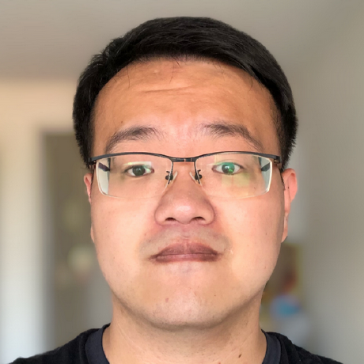

## About Me

Welcome! I am Wanying Ge (葛宛营), a Ph.D. student at EURECOM & Sorbonne University, supervised by [Prof. Nicholas Evans](https://www.eurecom.fr/en/people/evans-nicholas) and [Prof. Massimiliano Todisco](http://www.massimilianotodisco.eu/). 

My research interest includes speaker verification, voice anti-spoofing and explainable AI. Also, I studied speech separation and enhancement during my master's.

## Experience

* Research Intern, Idiap Research Institute, April 2023 - July 2023
* Marie Skłodowska-Curie Fellow & Ph.D. Candidate, Sorbonne University, September 2020 - Present

## Contact

Please send email to LASTNAME ~a~t~ eurecom dot fr.

And here is my [Google Scholar](https://scholar.google.com/citations?user=Gn-k3KYAAAAJ&hl=en) and [LinkedIn](https://www.linkedin.com/in/wanying-ge/) page.