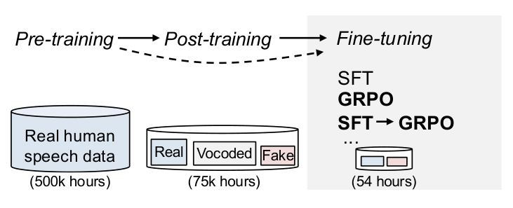
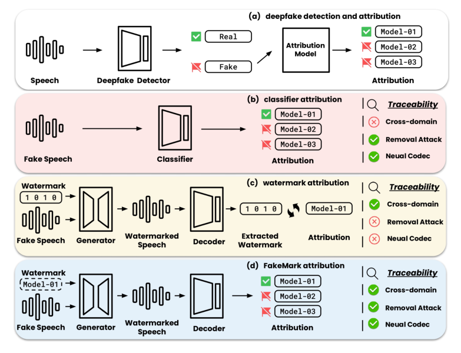
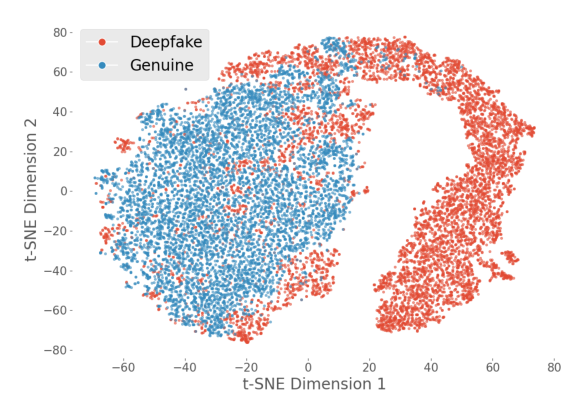
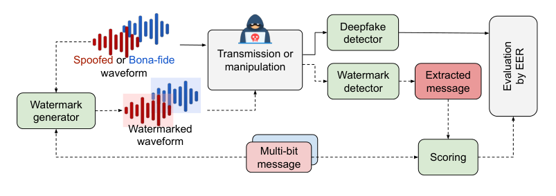
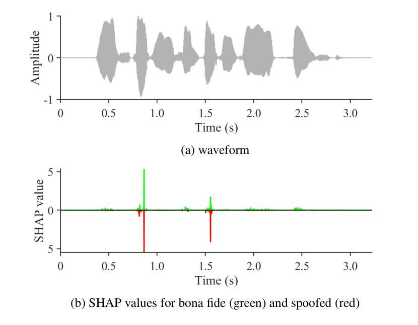
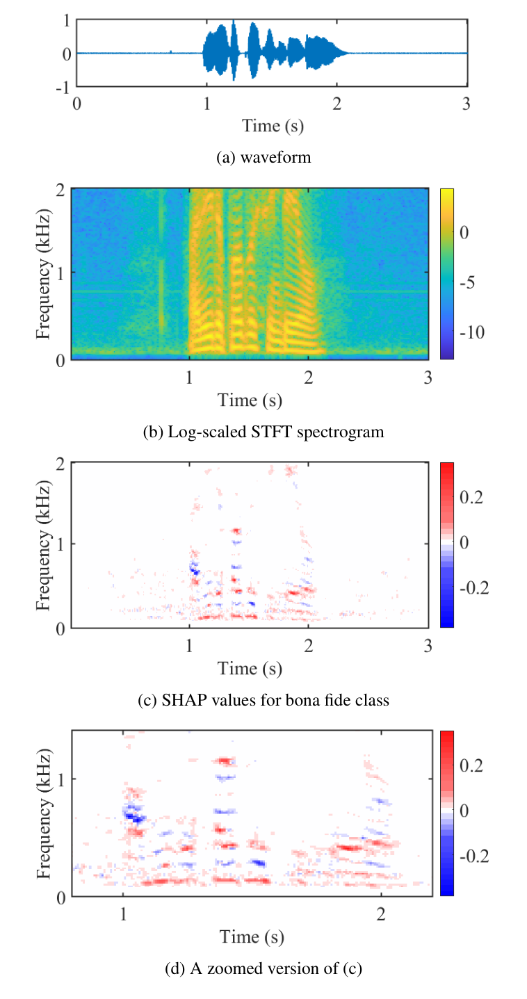
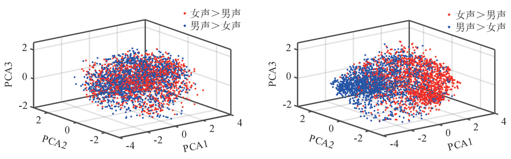

<link rel="stylesheet" href="https://cdnjs.cloudflare.com/ajax/libs/font-awesome/6.0.0-beta3/css/all.min.css">

## About me

Hello! I am Wanying Ge (葛宛营). I'm a postdoc at [Yamagishi Lab](https://nii-yamagishilab.github.io/), National Institute of Informatics, Japan. I defended my Ph.D. from Sorbonne University & EURECOM, supervised by [Prof. Nicholas Evans](https://www.eurecom.fr/en/people/evans-nicholas) and [Prof. Massimiliano Todisco](http://www.massimilianotodisco.eu/).

My research focuses on speech processing, with experience in watermarking, deepfake detection, speaker verification, and source separation.

## Experience

* Postdoctoral Researcher, National Institute of Informatics, August 2024 - Present
* Ph.D., Sorbonne University, September 2020 - May 2024
* Marie Skłodowska-Curie Research Fellow, EURECOM, September 2020 - May 2024
* Research Intern, Idiap Research Institute, April 2023 - July 2023

## Selected publications

    

        
    

    

    

        [INTERSPEECH '26] Does Fine-tuning by Reinforcement Learning Improve Generalization in Binary Speech Deepfake Detection?
        <a href="https://arxiv.org/pdf/2603.02914" target="_blank">
            <i class="fas fa-file-pdf"></i>
        </a>
        <a href="https://github.com/nii-yamagishilab/AntiDeepfake/blob/main/README_grpo.md" target="_blank">
            <i class="fab fa-github"></i>
        </a>
     
        Xin Wang, Wanying Ge, Junichi Yamagishi 
        <em>in INTERSPEECH 2026.</em>
    

    

    

        
    

    

    

        [CVPR Workshop '26] FakeMark: Deepfake Speech Attribution With Watermarked Artifacts
        <a href="https://arxiv.org/pdf/2510.12042" target="_blank">
            <i class="fas fa-file-pdf"></i>
        </a>
     
        Wanying Ge, Xin Wang, Junichi Yamagishi 
        <em> The Authenticity & Provenance in the Age of AI workshop.</em>
     
        The local <a href="https://www.denverartmuseum.org/en" target="_blank">museum</a> is one of the best I visited.
    

    

    

        
    

    

    

        [ASRU '25] Post-training for Deepfake Speech Detection
        <a href="https://arxiv.org/pdf/2506.21090.pdf" target="_blank">
            <i class="fas fa-file-pdf"></i>
        </a>
        <a href="https://github.com/nii-yamagishilab/AntiDeepfake" target="_blank">
            <i class="fab fa-github"></i>
        </a>
     
        Wanying Ge, Xin Wang, Xuechen Liu, Junichi Yamagishi 
        <em>in Proc. IEEE ASRU 2025, pp. 1-8.</em>
     
        This <a href="https://www.youtube.com/watch?v=j7lp3RhzfgI&t=120s" target="_blank">song</a> came to my mind every time downloading and preparing large databases.
    

    

    

        
    

    

    

        [INTERSPEECH '25] A Comparative Study on Proactive and Passive Detection of Deepfake Speech
        <a href="https://arxiv.org/pdf/2506.14398.pdf" target="_blank">
            <i class="fas fa-file-pdf"></i>
        </a>
        <a href="https://github.com/nii-yamagishilab/antispoofing-watermark" target="_blank">
            <i class="fab fa-github"></i>
        </a>
     
        Chia-Hua Wu, Wanying Ge, Xin Wang, Junichi Yamagishi, Yu Tsao, Hsin-Min Wang 
        <em>in Proc. INTERSPEECH 2025, pp. 5328-5332.</em>
    

    

    

        
    

    

    

        [Odyssey '22] Explainable Deepfake and Spoofing Detection: An Attack Analysis Using SHapley Additive exPlanations
        <a href="https://arxiv.org/pdf/2202.13693.pdf" target="_blank">
            <i class="fas fa-file-pdf"></i>
        </a>
        <a href="https://github.com/eurecom-asp/shap-anti-spoofing" target="_blank">
            <i class="fab fa-github"></i>
        </a>
     
        Wanying Ge, Massimiliano Todisco, Nicholas Evans 
        <em>in Proc. The Speaker and Language Recognition Workshop (Odyssey 2022), pp. 70-76.</em>
     
        The statement we wrote in Section 4, &ldquo;We accept that, within our current framework, it is impossible to fully isolate classifier behaviour from attack artefacts, since the latter are always learned using a specific classifier.&rdquo; was inspired by <a href="https://www.goodreads.com/book/show/59575939-an-immense-world" target="_blank">this book</a>.
    

    

    

        
    

    

    

        [ICASSP '22] Explaining Deep Learning Models for Spoofing and Deepfake Detection With SHapley Additive exPlanations
        <a href="https://arxiv.org/pdf/2110.03309.pdf" target="_blank">
            <i class="fas fa-file-pdf"></i>
        </a>
     
        Wanying Ge, Jose Patino, Massimiliano Todisco, Nicholas Evans 
        <em>in Proc. ICASSP 2022, pp. 6387-6391.</em>
     
        I was attending a session on my Master topic when I realized I could apply the same <a href="https://www.isca-archive.org/interspeech_2021/sivasankaran21_interspeech.pdf" target="_blank">method</a> to my PhD topic.
    

    

    

        
    

    

    

        Monaural Noisy Speech Separation Combining Sparse Non-negative Matrix Factorization and Deep Attractor Network
        <a href="https://www.jac.ac.cn/en/article/doi/10.15949/j.cnki.0371-0025.2021.01.006" target="_blank">
            <i class="fas fa-file-pdf"></i>
        </a>
     
        Wanying Ge, Tianqi Zhang, Congcong Fan, Tian Zhang 
        <em>Chinese Journal of Acoustics, 2020.</em>
     
        In my thesis, another version of this figure is a mixture of a female voice &ldquo;I am the mask you wear&rdquo; and a male voice &ldquo;It&rsquo;s me they hear&rdquo;, from <a href="https://www.youtube.com/watch?v=EGb4hj-EXt0" target="_blank">here</a>.
    

    

## Contact

Please send email to gewanying ~a~t~ nii dot ac dot jp.

And here is my [Google Scholar](https://scholar.google.com/citations?hl=en&user=Gn-k3KYAAAAJ&view_op=list_works&sortby=pubdate), [Researchmap](https://researchmap.jp/wanying-ge?lang=en), and [LinkedIn](https://www.linkedin.com/in/wanying-ge/) page.

## Hit counter

    1895

    "I reset that counter last night. This blog had nearly two thousand hits in the last eight hours. This is your living."
    &mdash;Dr. John Watson, "A Scandal in Belgravia"

